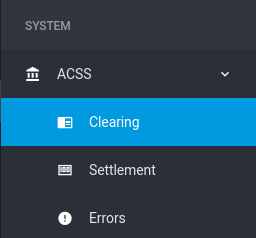
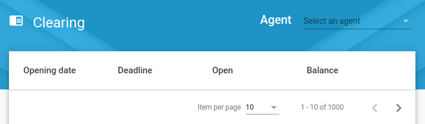
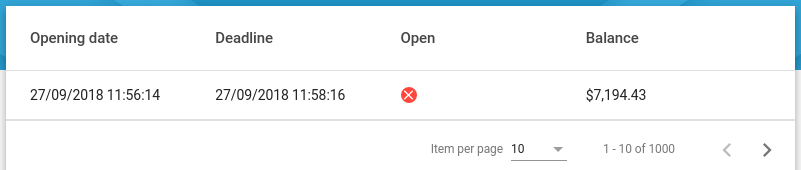
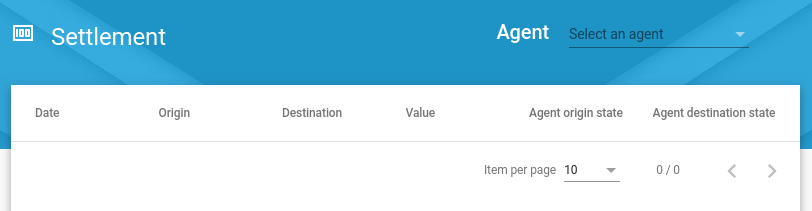

# ACSS

"ACSS" is the abbreviation for Automatic Clearing and Settlement System. The general purpose of this service is generate clearings and settlement according to the differentes agents and the transactional configuration registered on the platform which indicates how the money is divided. 

All of the transactions performed in the system, such as card reloads, sale transactions, payments, among others are processed, cleared and settled.

_This MicroService is built on top of NebulaE MicroService Framework.  Please see the [FrameWork project](https://github.com/NebulaEngineering/nebulae) to understand the full concept_**.


# Table of Contents
  * [Project Structure](#structure)
  * [FrontEnd](#frontend)
    *  [Environment variables](#frontend_env_vars)
  * [API](#api)
    * [GraphQL throught gateway API](#api_gateway_graphql)
  * [BackEnd](#backend)
    *  [acss](#backend_acss)
        * [Environment variables](#backend_acss_env_vars)
        * [Event Sourcing](#backend_acss_eventsourcing)
        * [CronJobs](#backend_acss_cronjobs)
  * [Development environment](#dev_env)
# Project structure <a name="structure"></a>

```
├── frontend                            => Micro-FrontEnd  
│   └── emi                      => Micro-FrontEnd for [emi FrontEnd](https://github.com/nebulae-pyxis/emi)
├── api                                 => Micro-APIs  
│   └── gateway                           => Micro-API for [gateway API](https://github.com/nebulae-pyxis/gateway)  
├── backend                             => Micro-BackEnds  
│   ├── acss                     => Micro-BackEnd responsible for ...
├── etc                                 => Micro-Service config Files.  
│   └── mapi-setup.json                 => Micro-API setup file  
│   └── mfe-setup.json                  => Micro-Frontend setup file  
├── deployment                          => Automatic deployment strategies  
│   ├── compose                         => Docker-Compose environment for local development  
│   └── gke                             => Google Kubernetes Engine deployment file descriptors  
├── .circleci                           => CircleCI v2. config directory
│   ├── config.yml
│   └── scripts
├── docs                                => Documentation resources  
│   └── images 
│   └── drafts                          => Drafts where was defined the microservice
├── README.md                           => This doc
```
# Frontend <a name="frontend"></a>

If you want to navigate to ACSS section, go to System > ACSS



Once you enter to enter to ACSS, you will see three subsections:

- Clearing:

Here you can see info related with the clearings of the system. If the role of the logged user is "SYS ADMIN", you will be able to see the clearings of all of the agents registered on the platforms. While if the role of the user is "Business owner" only will be able to see the clearing associated with the agent which it belongs.


Fig 1. You can filter the clearings by agent




A clearing can have two states:

Open: If a clearing is open that means the clearing has not been settled therefore there are still transactions that can be processed and modify the info of the clearing (A open clearing is denoted with an green icon). 

Closed: If a clearing is closed that means the clearing has been settled (A closed clearing is denoted with an green icon). 

Clearing detail:


- Setttlement:

Here you can see info related with the settlements of the system. If the role of the logged user is "SYS ADMIN", you will be able to see the settlements of all of the agents registered on the platforms. While if the role of the user is "Business owner" only will be able to see the settlements associated with the agent which it belongs.


Fig 2. You can filter the settlements by agent


- Errors:

This subsections can only be see by an user with SYS ADMIN role.

Here you can see the errors ocurred on the system while the transactions, clearings or settlements were being processed.


# API <a name="api"></a>
Exposed interfaces to send Commands and Queries by the CQRS principles.
The MicroService exposes its interfaces as Micro-APIs that are nested on the general API.

## GraphQL throught gateway API <a name="api_gateway_graphql"></a>
These are the exposed GraphQL functions throught the [gateway API](https://github.com/nebulae-pyxis/gateway).  

Note: You may find the GraphQL schema [here](apigatewayraphql/acss/schema.gql)

### GraphQL Enums


### GraphQL types
* HelloWorld: Sample type, please remove
    * sn: String! => sample string
    
### GraphQL Queries
#### getHelloWorldFromacss
* Description : sample query, please remove
* returns : HelloWorld object.


### GraphQL Subscriptions

#### acssHelloWorldSubscription
* Description: sample subscription, please remove
* Data: HelloWorld object

### GraphQL Mutations
    N/A

# BackEnd <a name="backend"></a>
Backends are defined processes within a docker container.  
Each process is responsible to build, run and maintain itself.  

Each BackEnd has the following running commands:
  * npm start: executes main program
  * npm run get-ready: execute maintenance routines such DB indexes creation
  * npm run sync-state:  syncs backend state by reading all missing Events from the event-store
  * npm test: runs unit tests

## acss <a name="backend_acss"></a>
...


### Environment variables <a name="backend_acss_env_vars"></a>


```
+------------------------------------------+--------+----------------------------------------------------------------------------------------------+-------+-----------+
|                 VARIABLE                 | TYPE   |                                          DESCRIPTION                                         |  DEF. | MANDATORY |
|                                          |        |                                                                                              | VALUE |           |
+------------------------------------------+--------+----------------------------------------------------------------------------------------------+-------+-----------+
| production                               | bool   | Production enviroment flag                                                                   | false |           |
+------------------------------------------+--------+----------------------------------------------------------------------------------------------+-------+-----------+
| EVENT_STORE_BROKER_TYPE                  | enum   | Event store broker type to use.                                                              |       |     X     |
|                                          | string | Ops: PUBSUB, MQTT                                                                            |       |           |
+------------------------------------------+--------+----------------------------------------------------------------------------------------------+-------+-----------+
| EVENT_STORE_BROKER_EVENTS_TOPIC          | enum   | Event store topic's name.                                                                    |       |     X     |
|                                          | string |                                                                                              |       |           |
+------------------------------------------+--------+----------------------------------------------------------------------------------------------+-------+-----------+
| EVENT_STORE_STORE_TYPE                   | enum   | Event store storage type to use.                                                             |       |     X     |
|                                          | string | Ops: MONGO                                                                                   |       |           |
+------------------------------------------+--------+----------------------------------------------------------------------------------------------+-------+-----------+
| EVENT_STORE_STORE_URL                    | string | Event store storage URL or connection string.                                                |       |     X     |
|                                          |        | Eg.: mongodb://127.0.0.1:27017/test                                                          |       |           |
+------------------------------------------+--------+----------------------------------------------------------------------------------------------+-------+-----------+
| EVENT_STORE_STORE_AGGREGATES_DB_NAME     | string | Event store storage database name for Aggregates                                             |       |     X     |
|                                          |        | Eg.: Aggregates                                                                              |       |           |
+------------------------------------------+--------+----------------------------------------------------------------------------------------------+-------+-----------+
| EVENT_STORE_STORE_EVENTSTORE_DB_NAME     | string | Event store storage database name prefix for Event Sourcing Events                           |       |     X     |
|                                          |        | Eg.: EventStore                                                                              |       |           |
+------------------------------------------+--------+----------------------------------------------------------------------------------------------+-------+-----------+
| GOOGLE_APPLICATION_CREDENTIALS           | string | Production only.                                                                             |       |     X     |
|                                          |        | Google service account key path to access google cloud resources.                            |       |           |
|                                          |        |                                                                                              |       |           |
|                                          |        | Eg.: /etc/GOOGLE_APPLICATION_CREDENTIALS/gcloud-service-key.json                             |       |           |
+------------------------------------------+--------+----------------------------------------------------------------------------------------------+-------+-----------+
| LOCKVERSION                              | string | Production only.                                                                             |       |     X     |
|                                          |        | word or phrase used to evaluate if the sync task should be run before starting this backend. |       |           |
|                                          |        | This value must be changed to force state sync task.                                         |       |           |
+------------------------------------------+--------+----------------------------------------------------------------------------------------------+-------+-----------+
| MONGODB_URL                              | string | Materialized views MONGO DB URL                                                              |       |     X     |
|                                          |        | Eg.: mongodb://127.0.0.1:27017/test                                                          |       |           |
+------------------------------------------+--------+----------------------------------------------------------------------------------------------+-------+-----------+
| MONGODB_DB_NAME                          | string | Materialized views MONGO DB name                                                             |       |     X     |
|                                          |        | Eg.: DeviceAlarmReports                                                                  |       |           |
+------------------------------------------+--------+----------------------------------------------------------------------------------------------+-------+-----------+
| JWT_PUBLIC_KEY                           | string | RSA Public key to verify JWT Tokens.                                                         |       |     X     |
|                                          |        | Format: -----BEGIN PUBLIC KEY-----\nPUBLIC_KEY\n-----END PUBLIC KEY-----                     |       |           |
+------------------------------------------+--------+----------------------------------------------------------------------------------------------+-------+-----------+
| REPLY_TIMEOUT                            | number | TimeOut in milliseconds in case of sending data through the broker and waiting the response. |  2000 |           |
+------------------------------------------+--------+----------------------------------------------------------------------------------------------+-------+-----------+
| BROKER_TYPE                              | enum   | Broker type to use for inter-process communication.                                          |       |     X     |
|                                          | string | Ops: PUBSUB, MQTT                                                                            |       |           |
+------------------------------------------+--------+----------------------------------------------------------------------------------------------+-------+-----------+
```
#### Notes: 
  * ENV VARS for development are [here](backend/acss/.env)
  * ENV VARS for production are [here](deployment/gke/deployment-acss.yaml)

### Event Sourcing <a name="backend_acss_eventsourcing"></a>
    Event sourcing events this Micro-BackEnd is subscribed to or is publishing.
#### Subscribed events:    
*   EventType: what for ...

#### Published events: 
*   EventType: what for ...

### CronJobs <a name="backend_acss_cronjobs"></a>
Time-based jobs that are configured and triggered by the [CronJob MicroService](https://github.com/nebulae-pyxis/ms-cronjob)


# Development environment <a name="dev_env"></a>


## Install requeriments
* [node](https://nodejs.org/en/)
* [docker](https://docs.docker.com/install/)
* [docker-compose](https://docs.docker.com/compose/install/)
* [nodemon](https://www.npmjs.com/package/nodemon) 
   ```npm install -g nodemon```
* [Nebulae CLI](https://www.npmjs.com/package/@nebulae/cli)  
  ```npm install -g @nebulae/cli```  

## Prepare environment


### 1. clone this repo  
   ```git clone https://github.com/nebulae-pyxis/ms-acss.git```  
   
### 2. start databases, broker and security systems using docker-compose
```
cd deployment/compose/
docker-compose up
```
### 3. setup keycloak

#### LogIn to KeyCloak Admin Console
*  Navigate to http://localhost:8080/auth/admin/
*  user: keycloak
*  pass: keycloak  
    
#### Import Development realm: 
*  click on 'add realm' on the left panel
*  Select import option
*  import the file located at docs/resources/keycloakRealmToImport.json
  
#### Create the initial user:
* select the DEV_pyxis keycloak realm and click on the users option from the left panel.
* select 'add user' option , fill the needed fields and enable the 'Email Verified' option.
* set a password by editing the user, open the 'credentials' tabs, type a new password and deselect the 'Temporary' option


Add the **developer** and **operator** rol to your user:
* select user option in the left panel and click on your user id.
* select the 'role mapping' tab
* select **developer** and **operator** options from available roles and click on add selected

### 4. Create PlayGround folder
   PlayGround is a directory where we are going to place the FrontEnd and API shells so the developer can run tests
   ```
   cd  REPO_DIRECTORY
   mkdir playgorund   
   ```

### 5. Compose FrontEnd
```
nebulae compose-ui development --shell-type=FUSE2_ANGULAR --shell-repo=https://github.com/nebulae-pyxis/emi --frontend-id=emi --output-dir=/FULL_PATH_TO_REPO/ms-acss/playground/emi  --setup-file=/FULL_PATH_TO_REPO/ms-acss/etc/mfe-setup.json
```

### 6. Compose the API gateway
```
nebulae compose-api development --api-type=NEBULAE_GATEWAY --api-repo=https://github.com/nebulae-pyxis/gateway --api-id=gateway --output-dir=FULL_PATH_TO_REPO/ms-acss/playground/gateway  --setup-file=FULL_PATH_TO_REPO/ms-acss/etc/mapi-setup.json
```

### 7. Set the JWT token 
* LogIn to keycloak http://localhost:8080/auth/admin/ (user: "keycloak", pass: "keycloak")
* select the DEV_pyxis keycloak realm and click on 'realm settings' in left panel
* select keys option tab
* click on 'public key' from the RSA key and copy the contents.
* set this key value to the **JWT_PUBLIC_KEY** atribute in the following files: *WORKING_FOLDER*/ms-acss/backend/acss/.env   *WORKING_FOLDER*/ms-acss/playground/gateway/.env  
Note: use the following format: ```JWT_PUBLIC_KEY=-----BEGIN PUBLIC KEY-----\nPUT_HERE_JWT_PUBLIC_KEY_VALUE\n-----END PUBLIC KEY-----```
* Setup the Apollo engine key to trace API requests
    * create a key at https://engine.apollographql.com/ and set it to the **APOLLO_ENGINE_API_KEY** atribute in the playground/gateway/.env file

### 8. Remove FrontEnd base href used on production
change ```<base href="/emi/">``` to ```<base href="/">``` in the index.html located at playground/emi/src/index.html


## Start the development environment
1. Start the persistence layer, the broker and keycloak
```
cd deployment/compose/
docker-compose up
```
1. Start the Micro-BackEnd
```
cd backend/acss/
npm install
npm start
```
3. Start the API gateway
```
cd playground/gateway
npm run start-dev-env
```
4. Start the FrontEnd
```
cd playground/emi
npm run start-dev-env
```

Finally navigate to http://localhost:4200/
